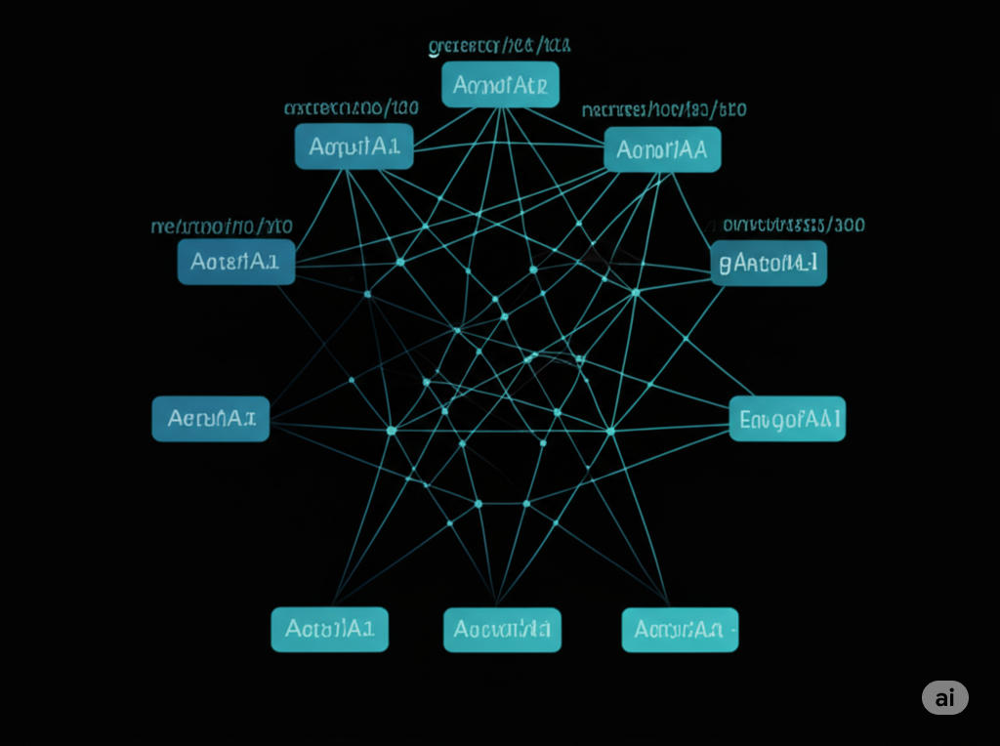

### Proyecto: Clasificación de Dígitos con Redes Neuronales 🧠

¡Bienvenido a este proyecto interactivo para explorar y comparar el rendimiento de diferentes arquitecturas de redes neuronales en la clasificación de dígitos escritos a mano!

---

### **Ver la Aplicación en Vivo 🚀**

Puedes interactuar con el aplicativo directamente en la siguiente URL:

👉 **[Ver Aplicación en Vivo](https://jhonyd55.github.io/Clasificacion-de-Digitos-Una-Comparativa-de-Redes-Neuronales/)**

---

### **Descripción del Proyecto**

Este proyecto demuestra el poder de las redes neuronales para resolver un problema clásico de visión por computadora. Compara tres modelos:
* **Red Neuronal Densa:** Un modelo básico.
* **Red Neuronal Convolucional (CNN):** Especializada en imágenes.
* **CNN Optimizada:** Con técnicas de regularización y aumento de datos para mejorar su desempeño.

Además de probar los modelos en tiempo real, se visualizan gráficos de precisión y pérdida para cada uno de ellos, permitiendo una comparación clara y concisa de su comportamiento durante el entrenamiento.

---

### **Características Destacadas**

| Característica | Descripción |
| :--- | :--- |
| **Demo Interactiva** | Dibuja un dígito en el lienzo y observa las predicciones de cada modelo. |
| **Visualización de Métricas** | Gráficos dinámicos de precisión y pérdida. |

---

### **Tecnologías y Acceso al Código 🛠️**

| Tecnología | Descripción | Icono |
| :--- | :--- | :--- |
| **TensorFlow.js** | Motor de IA para ejecutar modelos en el navegador. ||
| **Redes Neuronales**| Las arquitecturas que impulsan la predicción. |   |
| **Google Colab** | Accede al notebook original para ver el código de entrenamiento. |  |

**Enlace a Google Colab:** 

---

### **Licencia y Contribuciones**

Este es un proyecto de código abierto. Todos los usuarios tienen permiso de lectura y pueden explorar el código y los archivos del proyecto. La licencia es **MIT**.

